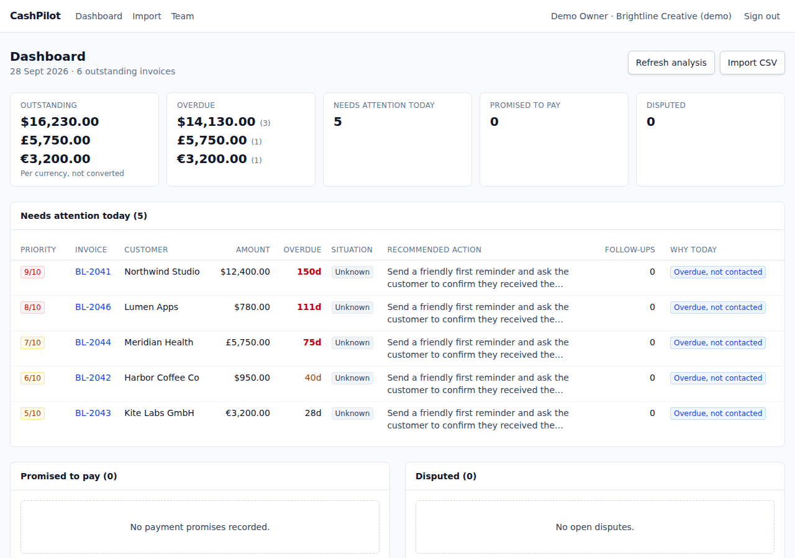

# CashPilot

CashPilot helps small agencies chase unpaid invoices without sounding like a debt collector.

It shows which overdue invoices need attention, drafts a polite reminder email, and never sends anything until you click **Approve & Send**.



## What it does

- **Import invoices** from a CSV file.
- **See what matters** on one dashboard: money outstanding, what needs attention today, and the highest-priority invoices.
- **AI analysis** explains why an invoice might be unpaid and what to do next.
- **Draft a follow-up email** — you can edit it, and unsafe wording (threats, guilt-tripping, legal language) is automatically blocked.
- **Approve & Send** — the only way an email goes out. Nothing sends itself.
- **Track replies** by hand: promised payment, dispute, paid, no response.
- **See the full history** of every invoice in a timeline.

Everyone signs in under one workspace per company. You can add teammates as members (can send) or viewers (read-only).

## Run it locally

You need Node.js 20.9+ and PostgreSQL.

```bash
npm install
cp .env.example .env          # edit this with your database URL
createdb cashpilot_dev
npm run db:migrate
npm run db:seed               # optional: adds a demo workspace with fake invoices
npm run dev
```

Open http://localhost:3000. If you ran the seed command, sign in with:

```
demo@cashpilot.local / demo-password-123
```

## Setting it up for real use

By default, CashPilot runs in "offline mode": AI analysis uses simple built-in rules (and does not read notes imported from CSV), and emails are only recorded, never sent. While either is true, every page shows a yellow banner saying so, and emails recorded this way are labelled "test mode · not delivered".

To use it for real:

1. Set `AI_PROVIDER=groq` and `GROQ_API_KEY=...` in `.env` for real AI analysis.
2. Set `EMAIL_PROVIDER=smtp` and your `SMTP_HOST` / `SMTP_USER` / `SMTP_PASSWORD` to actually send emails.

If a provider is selected but its key or host is missing, the banner says it is misconfigured. If Groq is unreachable, each analysis falls back to the built-in rules and is labelled "rule-based fallback".

Full list of settings: [`.env.example`](.env.example).

### Before a pilot with a real customer

- [ ] Run over HTTPS with `APP_URL` set to the https address.
- [ ] Set `AI_PROVIDER=groq` + `GROQ_API_KEY`, analyze one invoice with made-up data, and check the analysis says "groq" (not "offline mode" or "fallback").
- [ ] Set `EMAIL_PROVIDER=smtp` + SMTP settings + a real `EMAIL_FROM`, then Approve & Send one reminder to your own mailbox and check it arrives and replies come back to you.
- [ ] Confirm the yellow test-mode banner is gone.
- [ ] Import the customer's real export (see below) together with them the first time.

## CSV format

Required columns: `customer_name, customer_email, invoice_number, invoice_date, due_date, amount, currency`.
Optional: `account_manager, notes`.

Dates look like `2026-07-31`. Amounts are plain numbers like `1250.00`, no currency symbols. Currency is a 3-letter code like `USD` or `EUR`. See an example file: [`e2e/fixtures/invoices.csv`](e2e/fixtures/invoices.csv).

**Files with other column names** (for example an export from an accounting tool) can be uploaded as they are. CashPilot suggests which column holds each field and asks you to confirm before importing anything. When matching columns you can also choose day-first or month-first dates, use dates like `15 Jul 2026`, amounts with a currency symbol (`$4,250.00`), and one currency for every row if the file has no currency column. Every invoice still needs a customer email; if the export has none, add an email column first. This has been tested with hand-written files in typical export layouts, not yet with real exports from QuickBooks, Xero or other tools.

## Commands

| Command | What it does |
|---|---|
| `npm run dev` | Start the app locally |
| `npm run build` / `npm start` | Build and run for production |
| `npm test` | Run the automated tests |
| `npm run test:e2e` | Run the browser tests |
| `npm run db:migrate` | Apply database changes |
| `npm run db:seed` | Add demo data |

## Built with

Next.js, TypeScript, PostgreSQL, Tailwind CSS. AI runs through Groq (or an offline mode with no external calls).

## More details

- [PROGRESS.md](PROGRESS.md) — what's done and what's left
- [DECISIONS.md](DECISIONS.md) — choices made while building this
- [SECURITY_REVIEW.md](SECURITY_REVIEW.md) — security review and fixes
